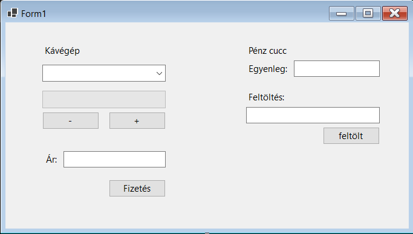

# Funkcionális specifikáció
## 1. Áttekintés
Egy olyan alkalmazást fejlesztettünk ki, amelyre egy cég kért meg minket. Szeretnének online formában is kávé rendeléseket fogadni, így a webhelyen megjelenő kávé automata programjának megírását ránk bízták. A felhasználónak lehetősége lesz az online pénztárcájának feltöltésére (így nem kell a futárnak fizetnie), különböző kávéfajták közül válogatnia, választhat hozzá cukrot és/vagy tejet, illetve előre látni fogja a rendelése végösszegét.

## 2. Jelenlegi helyzet
A megrendelő szeretné megnövelni a bevételét oly módon, hogy online is rendeléseket fogad, illetve azokat kiszállítja. Egy új alkalmazás előállítását rendelte meg, amely egy kávé automatára hasonlít. Ezen keresztül tudják a vásárlók kiválasztani, hogy mit szeretnének rendelni. Számos létező alkalmazást nézett meg a megrendelő, viszont egyik sem illett a cég profiljához, így amellett döntött, hogy egy teljesen új alkalmazás megrendelése miatt hozzánk fordul.

## 3. Jelenlegi üzleti folyamatok modellje
A mai világban, már a legtöbb cég rendelkezik online felülettel, ahol elérhetik a vásárlók a termékeiket. Sokkal kényelmesebbé és probléma mentesebbé teszi a vásárlást, valamit könnyebben elérhetőbbé teszi egyes termékek megvásárlását.

## 4. Igényelt üzleti folyamatok modellje
Azért hogy egyszerűbbé tegyük a vásárlók és eladók közötti interakciót, létrehozunk egy alkalmazást, ami a mai kornak megfelelően helyt tud állni az elektronikai világban. Az eladóknak egyszerűbb lesz nagyobb tömeget kiszolgálnia a rendelésekkel, így időt és munkaerőt takaríthat meg. A vásárlóknak is sokkal egyszerűbb lesz megrendelni az egyes kávékat, nem is kell elmenniük otthonról.

## 5. Követelménylista

## 6. Használati esetek
Felhasználó: A felhasználó fel tudja tölteni az elektronikus tárcáját, így vásárláskor onnan lesz kifizetve a rendelés és nem kell készpénzzel fizetnie a futárnál. Ki tudja választani, hogy milyen kávét szeretne, valamint, hogy kér-e hozzá extra cukrot, vagy tejet a kávéba.

## 7. Képernyőterv

## 8. Forgatókönyv
Futási időben kettő szereplő figyelhető meg.
Az egyik maga az alkalmazás, ami várja az input-ot, ami alapján elkészíti az italt, majd ellenörzi, hogy a felhasználó rendelkezik e a szükséges egyenleggel.
A másik szereplő a felhasználó, aki az ablakon elkhelyezett gombokkal testre tudja szabni az italát, és ha szükséges akkor az egyenlegét is feltudja tölteni.
Nem megfelelő egyenleg esetén megszakítódik a folyamat és az alkalmazás felszólít az egyenleg feltöltésére.

## 9. Fogalomszótár
input - Bemenet, amit az alkalmazás vár a felhasználótól 
online - Leggyakrabban arra használják, ha valami megtalálható az interneten vagy valaki fel van kapcsolódva az internetre.
